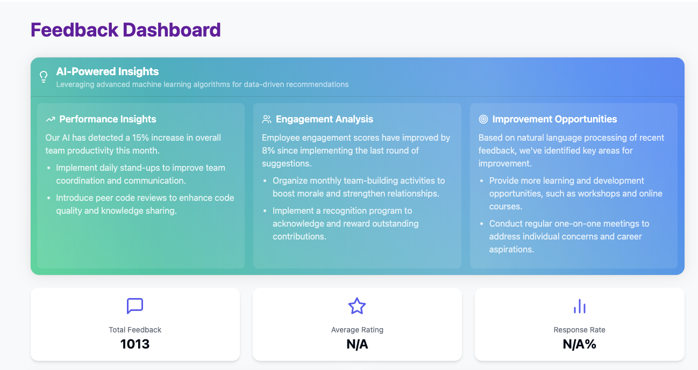
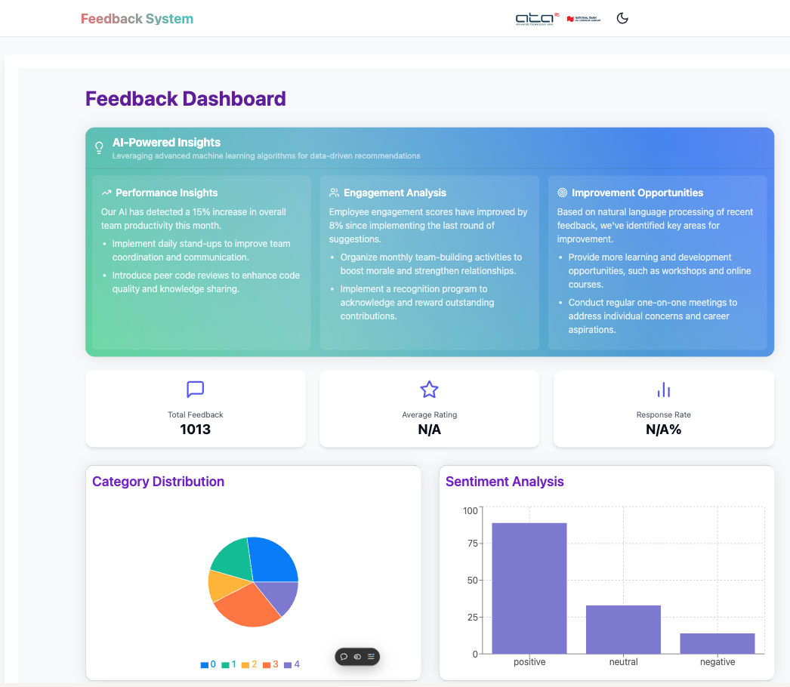
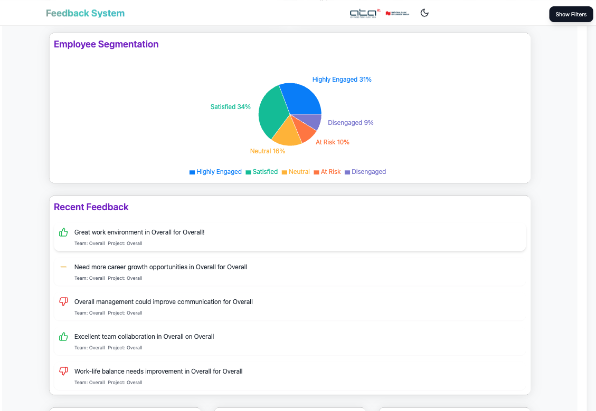

# Confidential Feedback System

This repository contains the **Confidential Feedback System**, designed to enhance employee engagement, streamline feedback processes, and improve workplace productivity. The system provides a secure and anonymous platform for employees to share feedback with their teams and HR, empowering organizations to act on insights and foster a healthy work environment.


## Table of Contents

- [Overview](#overview)
- [Features](#features)
- [Mock-ups](#mock-ups)
- [Technologies Used](#technologies-used)
- [System Architecture](#system-architecture)
- [Installation](#installation)
- [Usage](#usage)
- [Contributors](#contributors)
- [License](#license)

## Overview

The **Confidential Feedback System** aims to provide a safe and effective way for employees to share feedback anonymously or publicly. The system collects, analyzes, and visualizes feedback data to help companies like **ATA IT Limited** make data-driven decisions to improve team performance and workplace satisfaction.

### Key Objectives:
- Protect anonymity and ensure confidentiality of employee feedback.
- Utilize data-driven insights to improve employee satisfaction and productivity.
- Streamline feedback processes through automation and AI-driven analysis.

## Features

- **Anonymous and Named Feedback**: Employees can choose to provide feedback anonymously or attach their name.
- **Sentiment Analysis**: The system uses AI to categorize and analyze feedback sentiment.
- **Feedback Categories and Privacy Levels**: Customizable categories and privacy levels for different feedback types.
- **Real-Time Data Analytics**: View insights in real time via dashboards with key performance indicators (KPIs).
- **Secure Communication with HR**: Ensures confidentiality and security of sensitive feedback.
- **End-to-End Encryption**: Protects all feedback data in transit and at rest.
- **Role-Based Access Control (RBAC)**: Secure access to feedback data based on user roles.
- **Audit Logs**: Track feedback actions and ensure transparency.
- **Critical Feedback Alerts**: Immediate notifications for feedback requiring urgent attention.
- **Follow-Up Mechanism**: Allows HR to follow up with employees regarding critical feedback.
- **Multi-Platform Access**: Accessible via web and mobile applications.

## Mock-ups

Here are mock-ups of the **Confidential Feedback System**:


*Cover 1: Dashboard Overview*


*Cover 2: Feedback Submission Form*


*Cover 3: Sentiment Analysis*

These mock-ups give a visual representation of the front-end design of the system.

## Technologies Used

- **Frontend**: 
  - React.js
  - Next.js
  - Tailwind CSS
  - NextUI
- **Backend**: 
  - Java Spring Boot (Microservices Architecture)
- **Database**: 
  - MongoDB
- **Data Processing & Analytics**: 
  - Apache Spark
  - Fluentd (ETL for Logging)
- **Authentication & Authorization**: 
  - JWT (JSON Web Token)
  - OAuth
  - Role-Based Access Control (RBAC)
- **Others**:
  - Docker (Containerization)
  - Kubernetes (Orchestration)
  - Firebase (Mobile Web Storage)
  - Sonner (UI Notifications)

## System Architecture

 <!-- Replace this with your actual system architecture diagram link if you have one. -->

The system is built using a microservices architecture to ensure scalability and flexibility. Below are the core components:

1. **Feedback Service**: Handles feedback submission and retrieval, supports both anonymous and named feedback.
2. **Analytics Service**: Runs sentiment analysis and processes feedback for insights.
3. **Notification Service**: Sends reminders, alerts, and notifications for critical feedback.
4. **UI/UX Layer**: Provides a seamless user experience for both employees and HR administrators.
5. **Authentication & Authorization Service**: Manages secure access to the system with RBAC.

## Installation

Follow these steps to set up the project locally.

1. Clone the repository:
   ```bash
   git clone https://github.com/6531503042/mood-metrics.git
   cd mood metrics

    ```
2. Install frontend dependencies:
```bash
cd frontend
bun install
```

3. Install backend dependencies:
```bash
cd backend
./mvnw install
```

4. Start the backend service:
```bash
./mvnw spring-boot:run
```

5. Start the frontend service:
```bash
cd frontend
bun run dev
```

6. Access the app at http://localhost:8081

## Usage
### For Employees:
1. Submit feedback using the feedback form.
2. Choose to submit feedback anonymously or under your name.
3. View the progress of feedback submissions on your dashboard.


### For HR/Admins:
1. Log in using secure credentials.
2. View categorized feedback and sentiment analysis.
3. Generate reports and view insights to make data-driven decisions.
4. Use the follow-up mechanism to respond to critical feedback.

# Contributors
- Nimit - Backend Developer, Frontend Developer, DevOps Developer, Project Manager
- Kritsakorn - Frontend Developer, UX/UI
- Kongphop - Frontend Developer, UX/UI

# License
This project is licensed under the MIT License. See the LICENSE file for details.

Developed with ❤️ by the team at ATA IT Limited and [SEEZ's Team Dev].


### Key Sections:

- **Overview**: Gives a brief summary of the project’s goals and who the stakeholder is.
- **Features**: Outlines the key functionality of the system.
- **Technologies Used**: Lists the stack you're using.
- **System Architecture**: Includes a placeholder for your architecture diagram.
- **Installation**: Step-by-step guide to run the project locally.
- **Usage**: Quick guide for different user roles (employees and admins/HR).
- **Contributors**: Lists your team members involved in the project.
- **License**: MIT license (you can change this based on your project’s actual license).

Let me know if you need any changes!
